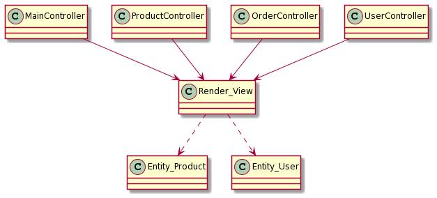

# UML Class diagramms

Controllers

MVC

Basket

`@startuml
ISocialNetwork <|.. SocialNetwork
ProductController --> Basket
ProductController ..> Service_Product
ProductController --> SocialNetwork
ProductController ..> Entity_Product
Basket ..> Service_Product
Service_Product ..> Repository_Product
Service_Product ..> Entity_Product
Repository_Product ..> Entity_Product
ISecurity <|.. Security
OrderController ..> Basket
OrderController ..> Security
OrderController ..> Entity_Product
UserController --> Security
Security ..> Repository_User
Security ..> Entity_User
Repository_User ..> Entity_User
Repository_User ..> Entity_Role
@enduml`

`@startuml
MainController --> Render_View
ProductController --> Render_View
OrderController --> Render_View
UserController --> Render_View
Render_View ..> Entity_Product
Render_View ..> Entity_User
@enduml`

`@startuml
Basket --> Card
Basket --> Email
Basket ..> NullObject
Basket ..> Security
Basket ..> ISecurity
Basket ..> IDiscount
Basket --> ICommunication
Basket --> IBilling
ISecurity <|.. Security
IBilling <|.. Card
IBilling <|.. BankTransfer
ICommunication <|.. Email
ICommunication <|.. SMS
IDiscount <|.. NullObject
IDiscount <|.. PromoCode
IDiscount <|.. VipDiscount
VipDiscount ..> Entity_User
SMS ..> Entity_User
Email ..> Entity_User
@enduml`
